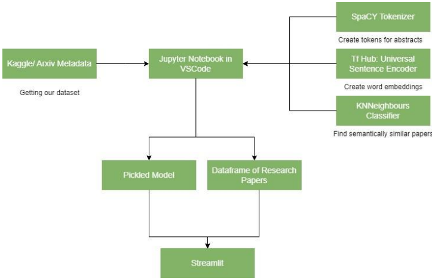
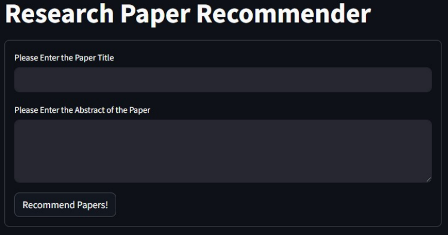
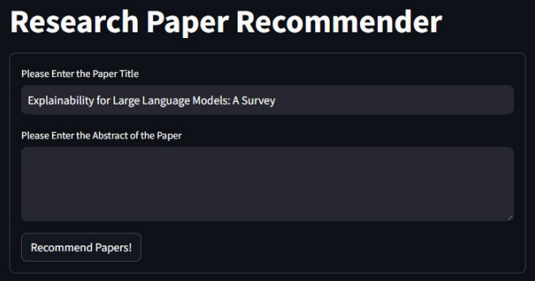
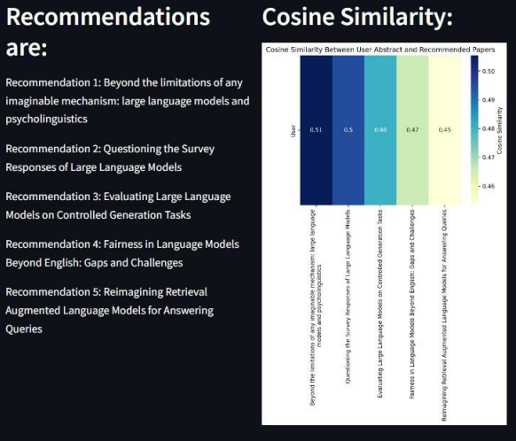
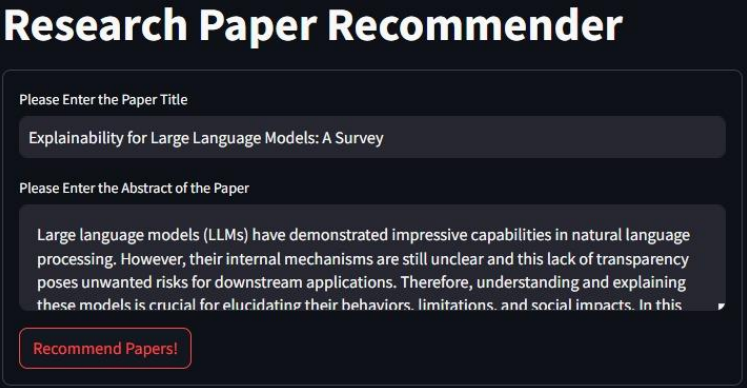
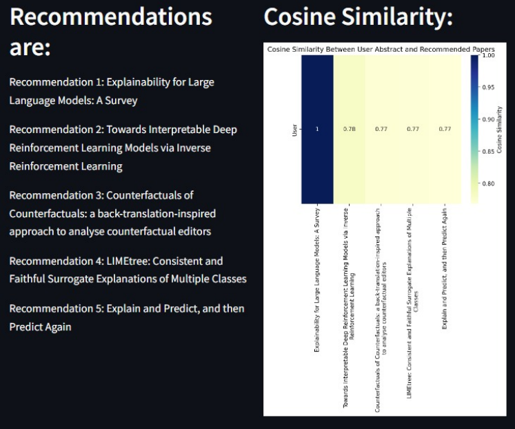

# Research-Paper-Recommendation-System

## Introduction  

In the ever-expanding field of academic research, the volume of scholarly articles and publications can be overwhelming, making it even more difficult for researchers to navigate and identify relevant content. To understand this need for an effective information service, our project aims to develop a complex recommendation system adapted specifically for research. The goal is to alleviate the information overload experienced by researchers by providing them with personalized and relevant suggestions based on their interests, preferences and previous reading habits. Such recommendation system can change the way researchers find and interact with the academic literature.  

Using advanced Natural Language Processing Practices and data analysis techniques, our project aims to streamline literature searches and ensure that researchers find the most relevant and impactful research in their field. With this project, weseek to address the unique challenges that the academic community faces in navigating the vast sea of scientific literature along with challenges associated with evaluation metrics in the absence of ground-truth labels. The development of a sound recommendation system can significantly influence the pace and quality of research, which contributes to the creation of a more dynamic and interconnected research landscape. As we delve into the complexities of this endeavour, we were am driven by the commitment to facilitate a seamless and productive research experience for researchers across disciplines.  
## Original Contributions  

Upon looking at varied recommender systems available for research papers, we observed that most of them work on co-citation or bibliographic similarity. There are a few which also work by finding similar paper by the authors or just do a simple keyword match from the title/ search query. we wanted to work on approaching semantic similarity as our basis for making new recommendations. we process the abstracts given by the user using NLTK tools and a transformer-based architecture which will be discussed further in methodology.  

## Technical Depth & Sophistication  
### Formal Problem Definition  
The main objective of the project involves taking 2 different inputs from the user i.e. research paper title and research paper abstract to give up to 5 recommendations that are content-based similar to the given paper. The project can work in two modes: 1. Title only 2. Title and Abstract, even though the recommendations are done for both modes, the ones made for the latter are more reliable.  
### Toolkit and Software Used  
1. spaCy: spaCy is a free, open-source library for advanced Natural Language Processing (NLP) in Python. spaCy’s trained pipelines can be installed as Python packages. During processing, spaCy first tokenizes the text, i.e. segments it into words, punctuation and so on. This is done by applying rules specific to each language. First, the raw text is split on whitespace characters. Then, the tokenizer processes the text from left to right. On each substring, it performs two checks: If the substring matches a tokenizer exception rule and if a prefix, suffix or infix be split off. If there is a match, the rule is applied and the tokenizer continues its loop, starting with the newly split substrings. This way, spaCy can split complex, nested tokens like combinations of abbreviations and multiple punctuation marks. In this script, tokenization is accomplished using the spaCy library, specifically the en_core_sci_lg model, which performs lemmatization, stop-word removal, and punctuation removal.
2. Universal Sentence Encoder: The core functionality of our system is the application of the Universal Sentence Encoder for semantic analysis. This cutting-edge approach in natural language processing (NLP) allows the system to understand the context and semantic meaning of research paper titles and abstracts. Unlike traditional NLP techniques that may rely on keyword frequency or syntactic analysis, the USE delves deeper into the linguistic structure, grasping the nuanced context and inherent meaning of the texts. This is particularly beneficial in the domain of academic research, where the complexity and specificity of language are high. The USE achieves this by transforming the variablelength text of paper titles and abstracts into fixed-length, high-dimensional vectors. These vectors are not mere numerical representations but encapsulate the semantic essence of the texts. The model's training on a vast corpus of text across various domains ensures its robustness and adaptability, allowing it to effectively process and interpret a wide range of academic topics and styles.  
Instead of relying on basic keyword matching, the system uses these semantic vectors to perform cosine similarity calculations. A higher cosine similarity score indicates a closer semantic relationship between the papers. This approach is particularly adept at overcoming the typical challenges faced in finding relevant research papers, such as the vastness of available literature, language barriers, and the dynamic nature of ongoing research. By focusing on semantic similarity, the system can recommend papers that are truly relevant to the user's input, even if they do not share exact keywords.
3. K-nearest neighbors: K-Nearest Neighbour is a simple algorithm that stores all the available cases and classifies the new data or case based on a similarity measure. It is mostly used to classifies a data point based on how its neighbours are classified. The algorithm is employed for clustering in the reduceddimensional space of USE embeddings. The KNN model, trained on the abstract embeddings, facilitates the identification of research papers similar to a user's input.
4. Pickle: In Python, serialization allows you to take a complex object structure and transform it into a stream of bytes that can be saved to a disk or sent over a network. The reverse process, which takes a stream of bytes and converts it back into a data structure, is called deserialization. Serialization can be used in a lot of different situations. One of the most common uses is saving the state of a neural network after the training phase so that you can use it later without having to redo the training. This is where pickle comes into play for us since we used this module to save our trained models and load them onto the streamlit script for easy integration.
5. Streamlit: Streamlit is an open-source Python library that makes it easy to create and share beautiful, custom web apps for machine learning and data science. It has been used for creating the user interface, providing an interactive platform for users to input paper titles and abstracts. The processed data is saved to a CSV file, and the trained KNN model is serialized using pickle, ensuring the system's reproducibility and enabling seamless integration into a web application. This cohesive integration of tokenization, USE, KNN clustering, Streamlit, and data serialization results in a robust and user-friendly research paper recommender system.
### Optimizations Done  
Since the dataset size has been very large as well as the size of the pickle moules, we have done optimization of our app by using caching. we have implemented an object-oriented and function-based architecture in the script in order to make caching of resources easier. By the use of Streamlit’s caching options, we were able to bring the response and loading time of the app from 4 minutes, down to 1 minute which is a great feat considering the app utilizes heavy models like Universal Sentence Encoder as well as the spaCy Tokenizer. we were also able to make our script faster in general by segmentation of model components into different files and being integrated all together during app’s runtime. This lead our app to reach an even faster runtime during it’s repetitive executions.
## System Architecture  

> System Architecture

1. Data Extraction: The dataset is loaded into the Jupyter notebook, we filter it out to keep research paper published since 2019 to make sure that the recommendations received are recent and way more relevant to the user's inputs. we make use of mostly 3 columns here: title, abstract and year to arrange the papers by a specific order.
2. Data Pre-processing: The pre-processing includes checking for missing or invalid data, once this cleaning is done, we move onto checking trends and patterns in the text like word count. This helps us select models and learning techniques accordingly.
3. Tokenization: Now that we have a dataframe of research papers that has been cleaned and processed once, we move onto tokenization. we begin with normalizing the text first i.e. making everything in text lowercase, removing punctuations and other stop words to make sure that our embeddings can be as accurate as possible. we use the SpaCy library for this due to its powerful performance as part of the NLTK toolkit. These tokenized and processed abstracts are put into a new dataframe.
4. Transformer training: For our transformer architecture, we make use of the Universal Sentence Encoder created by google. After using our desired specifications to load the model, we use it to create word embeddings for the abstracts processed in the tokenization process above. Once embeddings are created, we create a lookup table for our embeddings, assigning an index value to every row of the table for easier access.
5. Clustering: we use the k-NNeighbor classifier to cluster alike papers close by and fit our embeddings accordingly with the model under another variable.
6. Pickling: Once all the models have been trained, we use pickle module to save our embeddings model as well as classifier model. Along with these, we also create 2 different csvs’, one which contains the originally extracted data i.e. titles and abstracts whereas other contains the abstracts that were processed during tokenization.
7. Deploying on Frontend: we use a streamlit script for deploying our models onto streamlit. we start by loading all the necessary components: Universal sentence encoder's saved model, embeddings, Classifier's saved model, csv files and required libraries. Once the user gives the input, the abstract is then processed and tokenized similarly before its embeddings are made. Once we get embeddings of the input, we use classifier to cluster and give 5 closest papers to the seed paper.
8. Evaluation: For our model's evaluation, wehave used cosine similarity as the main metric which has a range of [-1, 1] and exhibits distance closer to 1 for semantically similar items. wecalculate the cosine similarities between the seed and recommended papers to construct a similarity matrix of 1 x 5 to showcase the similarity values between the papers. This matrix is represented as a graph on our frontend alongside the recommendations to give better visualization and context about the recommendations made.

The process from step 7 is repeat for every new input the application receives from the user.

## UI Aspects/Frontend 

> UI Overview

## Data set  
The research paper data is extracted from the dataset that is a mirror of the original ArXiv data i.e., a JSON file named "arxiv-metadata-oai-snapshot.json." Using a generator function, we read the file line
by line, parsing each line into a Python dictionary using json.loads(). An empty DataFrame called dataframe is initialized with columns for 'title,' 'year,' and 'abstract.' We iterate through each paper and extract relevant information such as the publication year, title, and abstract. Papers with an update date earlier than 2019 are excluded. The extracted details are then appended to the corresponding lists in the dataframe. We effectively filter and organize information from the JSON file, focusing on papers updated after 2019 and compiling their titles, publication years, and abstracts into a structured data format for further analysis.
## Results including preliminary evaluations  
The results as well as the preliminary evaluation is shown on the UI of the application where the results are the recommended papers, and the cosine similarity graph is the preliminary evaluations done for that search.

> When only title is entered

> Output only when title is entered

> When both title and abstract are entered

> Output when title and abstract are entered

## References
1. Cer, Daniel, et al. "Universal sentence encoder." arXiv preprint arXiv:1803.11175 (2018).
2. https://www.kaggle.com/datasets/Cornell-University/arxiv/data
3. https://www.kaggle.com/models/google/universal-sentenceencoder/frameworks/tensorFlow2/variations/universal-sentence-encoder
4. https://docs.streamlit.io
5. https://realpython.com/python-pickle-module/
6. https://spacy.io/usage/linguistic-features
7. https://www.tensorflow.org/hub/tutorials/semantic_similarity_with_tf_hub_universal_encoder
8. https://towardsdatascience.com/a-simple-introduction-to-k-nearest-neighbors-algorithmb3519ed98e
